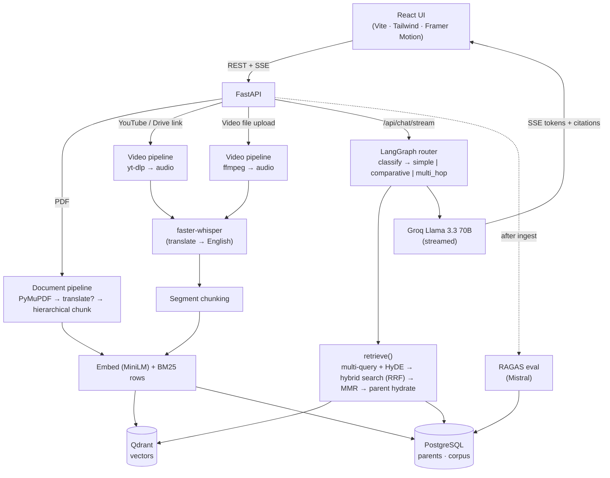

<div align="center">

# 🧠 SourceMind

**Chat with your documents and videos — in any language — with answers cited back to the exact page or timestamp.**

A production-grade, multi-modal **RAG** platform: ingest PDFs or videos (YouTube, Google Drive, or a file upload), then interrogate them in natural language over real-time streamed answers with page/segment citations.

<br>


</div>

---

## Why this exists

Most RAG demos split a document into fixed chunks, embed them, retrieve the top-k by cosine similarity, and call it a day. That falls apart in practice: short chunks lose context, query phrasing rarely matches the source, exact keywords get missed by vector search, multiple sources bleed into each other, and complex questions need more than one retrieval step. **SourceMind is built to fix each of those failure modes** — and to *measure* whether it worked.

| Problem with naïve RAG | How SourceMind solves it |
|---|---|
| Short chunks lose context | Hierarchical parent/child chunking |
| Query ↔ document phrasing mismatch | Multi-query rephrasing + HyDE |
| Vector search misses exact keywords | Hybrid search (BM25 + dense) via Reciprocal Rank Fusion |
| Redundant retrieved chunks | MMR reranking for diversity |
| Cross-source contamination | Per-source metadata filtering in Qdrant |
| Complex / comparative questions | LangGraph agentic router (simple / comparative / multi-hop) |
| "Is my retrieval any good?" | Automated RAGAS evaluation per source |

---

## Features

**Ingestion**
- 📄 **PDFs** — drag & drop, up to 100 MB / 500+ pages (PyMuPDF, page numbers preserved)
- 🎬 **Videos, three ways** — paste a **YouTube** link, paste a public **Google Drive** link, or **drag & drop a video file** (mp4/mov/mkv/webm/avi/m4v)
- 🌍 **Any language → English** — non-English sources are translated at ingestion (Whisper's translate task for video, Groq for PDFs), so you always chat in English
- ⚡ **Non-blocking** — ingestion runs in FastAPI background tasks; CPU-heavy work (Whisper, embeddings, PDF parsing) is offloaded to threads so the API never freezes

**Retrieval & generation**
- **Hierarchical chunking** — small 300-token children are embedded/searched; full 1500-token parents are what the LLM actually reads
- **Hybrid search** — dense (Qdrant cosine) + sparse (BM25) fused with **Reciprocal Rank Fusion**, then **MMR**-reranked for diversity
- **Multi-query + HyDE** — the query is auto-expanded with rephrasings and a hypothetical answer before retrieval
- **Agentic router** — a compiled **LangGraph `StateGraph`** classifies each question and dispatches to `simple`, `comparative` (decompose → parallel retrieve → synthesize), or `multi_hop` (retrieve → reason → retrieve → synthesize)
- **Streaming** — tokens stream to the UI over Server-Sent Events in real time
- **Cross-document chat** — a global endpoint answers across your *entire* library at once

**Evaluation & UX**
- 📊 **RAGAS** auto-evaluates each source (faithfulness, answer relevancy, context recall, context precision) — evaluator LLM is Mistral to stay within free-tier limits
- ✨ **Editorial UI** — a warm, light "library" theme (React + Tailwind + Framer Motion) with Markdown-rendered answers and collapsible, numbered citations
- 💸 **100% free model stack** — Groq LLMs + local HuggingFace embeddings + local faster-whisper

---

## Tech stack

| Layer | Tools |
|---|---|
| Frontend | React 18 · Vite · TailwindCSS · Framer Motion · React Query · React Router · EventSource (SSE) · react-markdown |
| Backend | FastAPI (async) · asyncpg · Pydantic v2 |
| Vector DB | Qdrant (cosine, metadata-filtered) |
| Relational DB | PostgreSQL 16 (parent chunks · BM25 corpus · eval results · chat history) |
| Embeddings | sentence-transformers `all-MiniLM-L6-v2` — local, 384-dim, CPU |
| LLMs | Groq — Llama 3.3 70B (answers), Llama 3.1 8B (auxiliary) |
| Evaluator LLM | Mistral `mistral-small-latest` (falls back to Groq 8B) |
| Transcription | faster-whisper `small` — local, CTranslate2 int8 |
| Agent / RAG | LangChain + a compiled LangGraph `StateGraph` |
| Evaluation | RAGAS |
| Infra | Docker Compose |

---

## Architecture



**Request path for a chat query:** `GET /api/chat/stream` → LangGraph router → `retrieve()` → hybrid search → Groq 70B, streamed back as SSE. Retrieved child chunks are swapped for their full parent chunks before the model sees them, and every retrieval is filtered by `source_id` (omitted for global chat).

---

## Quick start (Docker)

**Prerequisites:** Docker + Docker Compose, a free [Groq API key](https://console.groq.com/keys), and optionally a free [Mistral API key](https://console.mistral.ai) (used as the RAGAS evaluator; falls back to Groq without it).

```bash
git clone https://github.com/Saicharan519/sourcemind.git
cd sourcemind
cp .env.example backend/.env      # then edit backend/.env and set GROQ_API_KEY
docker compose up --build
```

First boot downloads the embedder (~90 MB) and the Whisper model (~460 MB); later boots are fast thanks to persistent volumes.

- **App** → http://localhost:5173
- **API docs** → http://localhost:8000/docs
- **Qdrant dashboard** → http://localhost:6333/dashboard

---

## Local development (without Docker)

Run the two databases in Docker and the app on the host.

```bash
# 1. Databases
docker run -d --name sourcemind-postgres -e POSTGRES_USER=sourcemind \
  -e POSTGRES_PASSWORD=sourcemind_secret -e POSTGRES_DB=sourcemind \
  -p 5432:5432 postgres:16-alpine
docker run -d --name sourcemind-qdrant -p 6333:6333 qdrant/qdrant

# 2. Schema (once)
docker exec -i sourcemind-postgres psql -U sourcemind -d sourcemind < scripts/init_db.sql

# 3. Backend  (.env must live in backend/)
cd backend
python -m venv .venv && source .venv/bin/activate   # Windows: .venv\Scripts\activate
pip install -r requirements.txt
cp ../.env.example .env            # set GROQ_API_KEY (+ optional MISTRAL_API_KEY)
python -m uvicorn main:app --reload --port 8000

# 4. Frontend (new terminal)
cd frontend && npm install && npm run dev
```

> **Note:** `ffmpeg` must be on your PATH (required by Whisper, yt-dlp, and video-file ingestion).

---

## API reference

| Method | Path | Description |
|---|---|---|
| `POST` | `/api/ingest/document` | Upload a PDF (202, processed in background) |
| `POST` | `/api/ingest/video` | Ingest a YouTube **or public Google Drive** link |
| `POST` | `/api/ingest/video-file` | Upload a video file (mp4/mov/mkv/webm/avi/m4v) |
| `GET` | `/api/sources` | List all sources with eval scores |
| `GET` | `/api/sources/{id}` | Source detail + full RAGAS results |
| `DELETE` | `/api/sources/{id}` | Delete a source (cascades to Qdrant + Postgres) |
| `GET` | `/api/chat/stream` | **SSE** per-source streaming chat |
| `GET` | `/api/chat/global/stream` | **SSE** cross-document chat |
| `POST` | `/api/evaluate/{id}` | Manually (re)run RAGAS evaluation |
| `GET` | `/api/evaluate/{id}` | Fetch latest RAGAS results |

**SSE event stream:**
```
data: {"type": "query_type",  "value": "comparative"}
data: {"type": "sub_queries", "value": ["...", "..."]}   // comparative / multi-hop only
data: {"type": "citations",   "value": [{"type":"document","page_number":4,"excerpt":"..."}]}
data: {"type": "token",       "value": "The "}
data: {"type": "done",        "value": null}
```

---

## Model routing (free-tier strategy)

Quality where it matters, speed everywhere else — this split is what keeps the whole thing on free tiers.

| Task | Model |
|---|---|
| Final answer + comparative synthesis | Groq **Llama 3.3 70B** |
| Classification · multi-query · HyDE · decomposition · multi-hop reasoning · titles · QA generation | Groq **Llama 3.1 8B** |
| RAGAS evaluator | **Mistral** `mistral-small-latest` (→ Groq 8B fallback) |
| Embeddings | local `all-MiniLM-L6-v2` (CPU) |
| Transcription | local faster-whisper `small` (CPU, int8) |

---

## Project structure

```
sourcemind/
├── backend/
│   ├── main.py               # FastAPI app + lifespan
│   ├── api/routes/           # ingest · chat · global_chat · sources · evaluate
│   ├── core/
│   │   ├── document_pipeline.py   video_pipeline.py   chunker.py
│   │   ├── embedder.py            bm25_index.py       hybrid_search.py
│   │   ├── rag_engine.py          agent_router.py     evaluator.py
│   │   ├── db/ (postgres.py · qdrant.py)  utils/ (audio.py · streaming.py)
│   └── requirements.txt
├── frontend/src/             # pages · components · hooks · api client
├── scripts/init_db.sql
└── docker-compose.yml
```

---

## Roadmap

- **GPU transcription** + a local/Groq transcription mode toggle (auto-detect CUDA)
- One-command cloud deploy (Render/Railway · Neon · Qdrant Cloud · Vercel)
- Postgres full-text search to replace the per-query BM25 rebuild at scale

---

## Troubleshooting

- **`.env` not picked up** → it must live in `backend/`, not the repo root (config loads it relative to the backend's working directory).
- **`yt-dlp` "Requested format is not available"** → YouTube changed formats; run `pip install -U yt-dlp`.
- **Google Drive link fails** → the video must be shared as *"Anyone with the link."*
- **Model downloads look stuck** → first run pulls ~600 MB of models; subsequent runs use the cache/volumes.
- **Scanned PDF returns empty pages** → PyMuPDF can't read image-only PDFs; OCR them first (`ocrmypdf`).

---

## License

MIT — do what you want.
